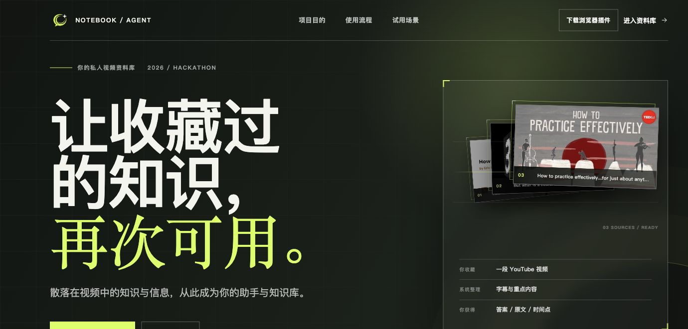
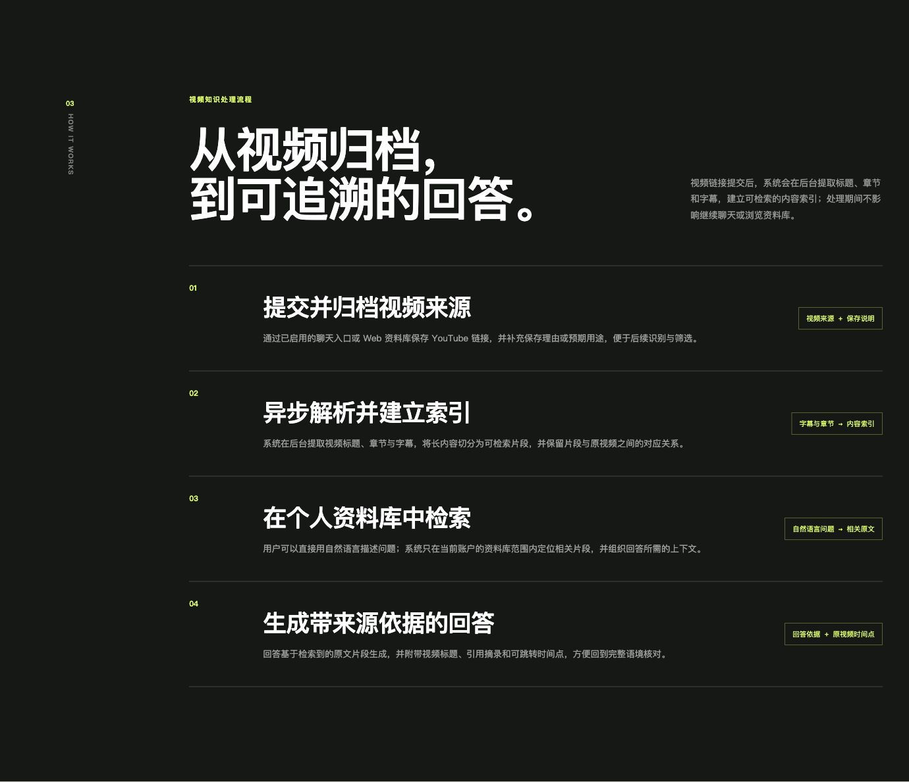
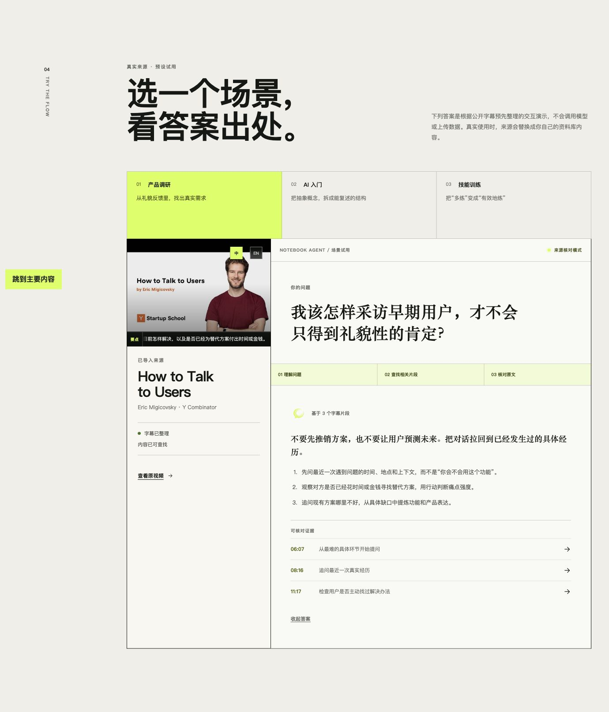

# Notebook Agent

[English](README.md) | [简体中文](README.zh-CN.md)

> 把收藏过的视频，变成需要时找得到、核对得上、还能回到原文的私人知识。

Notebook Agent 是一个面向视频学习和研究的私人 AI Agent。它把视频链接和字幕整理成属于你的可检索资料库：你可以在 Web 资料库中保存和查找内容，也可以通过 MCP 或可选的聊天入口提问。回答会返回检索到的原文依据、来源和时间戳，而不是只给出一个无法核对的总结。

[在线体验产品介绍与公开演示 →](https://notebookai.deequoique.tech/)

[](https://notebookai.deequoique.tech/)

**EAZO Global Hackathon Project**

## 为什么需要 Notebook Agent

人们会收藏课程、访谈、演讲和行业分析，但真正需要某个观点时，常常只记得模糊印象，不记得标题、出处或具体时间点。

收藏夹只能证明“保存过”，不能回答“内容讲了什么”“依据在哪里”以及“如何快速回到原文”。Notebook Agent 因此从“保存链接”继续向前一步，把视频变成能够检索、提问、核验和再次使用的个人知识。

## 目标用户与真实需要

- **深度学习者与学生：**在复习长课程或公开课时，快速找回一个概念及其上下文。
- **研究、产品与知识工作者：**跨多场访谈、分享或案例比较观点，并保留可核验的出处。
- **内容创作者：**从看过的素材中重新定位论点、案例和表达，不必重新观看整段视频。
- **重视隐私的个人用户与自托管用户：**希望资料彼此隔离，并通过熟悉的 Web、MCP 或聊天入口访问自己的知识库。

他们需要的是一条完整的路径：保存后自动整理，按自然语言找回内容，看到回答的证据，并能回到原视频确认上下文。

## 具体使用场景

### 复习长课程中的一个知识点

你只记得老师解释过某个概念，却忘了它出现在哪一节。提问后，Notebook Agent 会在你的资料库中检索相关字幕，展示原文片段和时间戳，帮助你直接回到对应位置。

### 比较多场访谈中的观点

保存多场访谈后，可以询问不同受访者对同一问题的共同点或差异。每个结论都保留对应视频来源，便于继续阅读和核对。

### 保存需要登录的课程页面

服务器无法直接读取需要登录的课程页面时，可以使用可选的浏览器伴侣，在你已经授权的浏览器会话中读取当前页面的字幕，再提交到同一个私人资料库。页面凭据、Cookie 和签名字幕地址不会作为服务端抓取任务上传。

### 在现有工作入口中提问

Web 资料库和 MCP 提供核心入口；如果你已经使用 Telegram 或微信，也可以通过可选的 LangBot bridge 接入。不同入口可以访问同一份私人资料，但仍受同一个用户空间的隔离规则约束。

## 从收藏到可核验回答：四步完成

Notebook Agent 的核心不是再建一个链接列表，而是让来源内容形成可追溯的使用闭环。

[](https://notebookai.deequoique.tech/#process)

1. **提交并归档视频来源：**在 Web 资料库或已启用的聊天入口保存视频链接，并补充备注或预期用途。
2. **异步解析并建立索引：**系统在后台提取标题、章节与字幕，把长内容切分为可检索片段；你可以继续浏览资料库。
3. **在个人资料库中检索：**用自然语言提问，只在当前用户的资料范围内定位相关原文并组织上下文。
4. **获得带来源依据的回答：**答案附上视频标题、引用摘录和可跳转时间点，便于回到原视频核对完整语境。

这条流程还支持：

- 在 Web 资料库中批量保存 URL、添加备注、搜索标题/作者/备注、查看内容与字幕、归档/恢复，以及对失败项目重试。
- 结合 PostgreSQL 全文检索和 pgvector 语义检索，在当前用户空间内找回相关片段。
- 由服务端校验引用依据并生成来源标题、真实 URL、片段和时间戳；检索不到足够依据时明确返回没有证据，而不是用模型记忆补写资料库内容。
- 通过 MCP 提供标准 `stdio` 和 Streamable HTTP 入口。每个客户端使用有范围的 grant：`read` 用于问答和资料浏览，`full` 才能执行保存等变更操作。
- 通过可选的浏览器伴侣获取已适配页面的字幕，或通过可选的 LangBot bridge 连接 Telegram 与微信。

## 产品体验与入口

### 回答是什么样

一次完整回答不只有结论，还包括这次检索使用了多少个字幕片段、对应的原文依据，以及可以跳回视频的时间点。你可以先读答案，再沿着证据逐条核对，而不必重新浏览整段视频。

[](https://notebookai.deequoique.tech/#demo)

上图来自产品页的公开预设演示：它不会调用模型或上传数据，仅用于展示“问题 → 回答 → 原文时间点”的交互。实际使用时，示例来源会替换为你自己资料库中的内容。

### Web 资料库

登录后，Web 资料库提供保存、搜索和管理的一站式界面。新提交的内容先进入整理队列；处理完成后进入可阅读区域。你可以查看标题、作者、备注、字幕和来源详情，并对失败内容重试、归档或恢复。

Web 对话会把答案和依据放在一起：原文片段、来源 URL 和视频时间戳由服务端根据本轮检索结果生成，方便从答案回到视频。

### MCP

MCP 适合接入桌面 Agent、自动化工具或其他 MCP 客户端，支持 `stdio` 和 Streamable HTTP。grant 与用户空间绑定，并按 `read` 或 `full` 限制可见工具；MCP Bearer 不会被当作 Web Cookie 使用，客户端也不能通过工具指定另一个用户的资料库。

### 浏览器伴侣

浏览器伴侣是可选的 Chrome/Chromium 扩展。你在 Web 中完成配对和批准后，它可以从当前的 YouTube 或 NTULearn/Kaltura 页面读取已适配的字幕，并把规范化后的字幕提交到 Notebook Agent。它不是任意登录网站的通用采集器，也不会把页面 Cookie、播放凭据或签名字幕 URL 交给服务端。已配对设备可以在 Web 中查看和撤销。

### Telegram 与微信

Telegram 和微信通过可选的 LangBot bridge 接入，不是核心运行的前置条件。跨渠道身份绑定使用一次性、限定目标渠道的代码；绑定后仍访问同一个用户空间，渠道对话历史保持分离。

## 可信边界与当前限制

| 能力 | 当前状态 |
| --- | --- |
| YouTube | 支持普通视频链接的服务器端导入；依赖可读取的字幕，平台没有可用字幕时不会凭空生成可核验内容。 |
| Bilibili | 支持普通视频链接；仅使用服务器无需持久化账号 Cookie 即可读取的字幕。登录后或服务器不可见的字幕不能通过当前服务器 connector 绕过访问限制。 |
| 浏览器伴侣 | 当前适配 YouTube 与 NTULearn/Kaltura 的特定页面，不代表支持任意网站；它读取字幕，不是通用音视频上传器。 |
| 证据与回答 | 只引用当前用户资料库中本轮检索到的证据；来源和时间戳由服务端渲染。引用依据不足时返回受限结果。 |
| 隔离与渠道 | Web、MCP、Telegram 和微信都在用户空间边界内运行；LangBot 与浏览器伴侣均为可选组件。 |
| 尚未提供 | ASR 尚不是通用已发布能力；微信公众号文章导入也尚未实现。 |

因此，Notebook Agent 的承诺是“让已有来源更容易被找回和核验”，不是承诺访问所有平台、替你观看所有视频，或在没有字幕依据时自动补全内容。

## 开始使用与文档路径

### 快速自托管入口

如果你想运行完整的保存、整理和问答流程，需要 Python 3.11+、Docker Compose、PostgreSQL、Redis、S3-compatible object storage，以及 Agent 模型和 Zhipu Embedding API 凭据。Linux 和 macOS 可以使用项目自带的生命周期启动器；Windows 请按部署指南使用直接启动方式。

在项目根目录执行：

```bash
git clone https://github.com/deequoique/notebook-agent.git
cd notebook-agent

python -m venv .venv
source .venv/bin/activate
python -m pip install -e '.[dev]'

# 完整运行时：MCP、后台整理和可选渠道 gateway
./scripts/notebook-agent init --profile full
./scripts/notebook-agent start --profile full
```

只想连接已有资料并使用只读 MCP 时，可以选择 `read`；它不启动 Redis、MinIO、worker 或 Beat，也不会提供后台导入。`langbot` 用于需要后台/渠道运行时但不需要公共 MCP 的场景。连接客户端前，请按首次运行教程在与托管运行时相同的私有环境中创建用户并签发有范围的 grant。

按目标继续阅读：

- **第一次启动：** [首次运行教程](docs/tutorials/first-run.md)
- **使用 Web 资料库或浏览器伴侣：** [用户操作指南](docs/how-to/README.md) · [浏览器伴侣指南](docs/how-to/use-browser-companion.md)
- **接入 MCP、Telegram 或微信：** [用户操作指南](docs/how-to/README.md)
- **部署、备份、升级或排障：** [运维与部署指南](docs/how-to/README.md) · [运维手册](docs/operations/production/README.md)
- **查配置、运行模式和接口：** [参考文档](docs/reference/README.md)
- **了解架构、检索和隐私边界：** [原理说明](docs/explanation/README.md)
- **查看全部路径：** [文档总览](docs/README.md)

## 项目状态与许可

Notebook Agent 是为 **EAZO Global Hackathon** 构建的项目。核心 Web 资料库、证据优先问答、MCP、YouTube/Bilibili 服务器 connector，以及可选的浏览器伴侣和 LangBot 入口都已在当前仓库实现；不同部署 profile 的依赖和平台可达性仍需按文档验证。

当前项目元数据声明的许可证为 **Proprietary（专有许可）**，仓库未以通用开源许可证发布。
